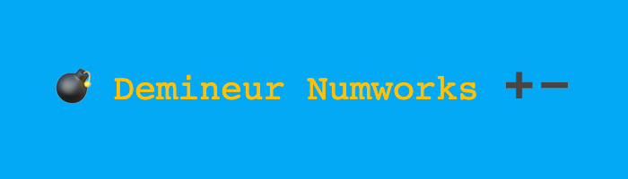
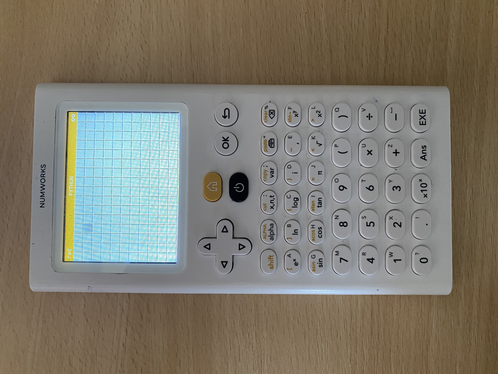
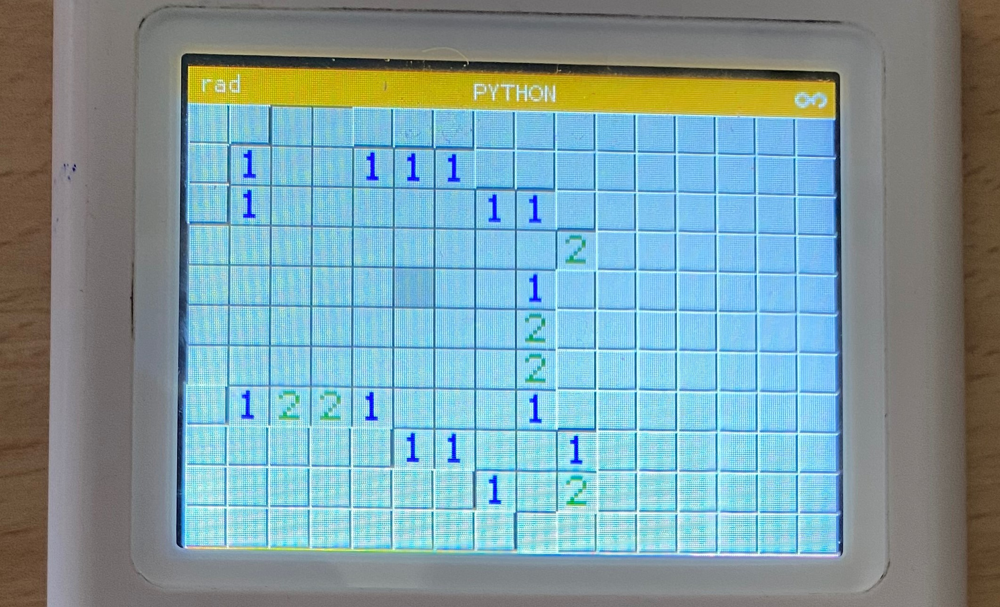
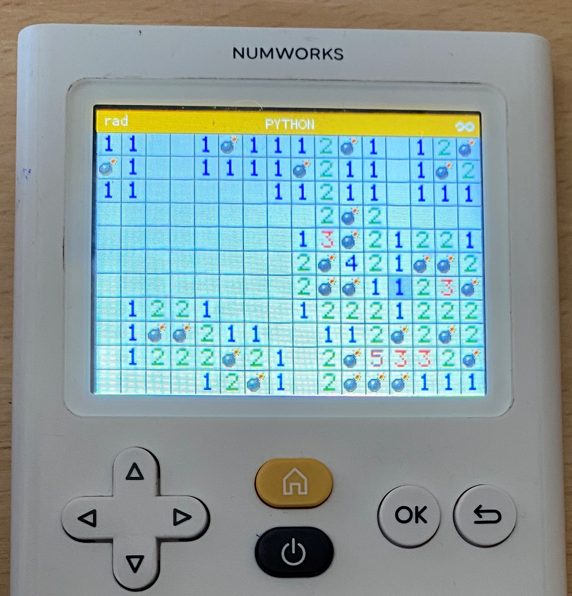

## Présentation
- Clone du démineur Microsoft (https://fr.wikipedia.org/wiki/Démineur_(genre_de_jeu_vidéo)) pour la calculatrice NumWorks (https://www.numworks.com)
- Codé en Python 

## Visuel
- Le jeu débute toutes les cases recouvertes 

- après une première sélection par l'utilisateur, une partie de la carte est dévoilée

- le joueur peut alors essayer de déduire la position des bombes à partir des nombres visibles

## Téléchargement et utilisation : 
1. depuis https://my.numworks.com/python/morabenji3 transférer les 4 scripts : 
  -  game.py
  -  bombe.py
  -  chiffre.py
  -  bouton.py

vers votre calculatrice NumWorks

🤷‍♂️ comment transférer les scripts vers la calculatrice ? https://www.numworks.com/fr/assistance/connexion/echange-script/

2. exécuter le programme game.py
